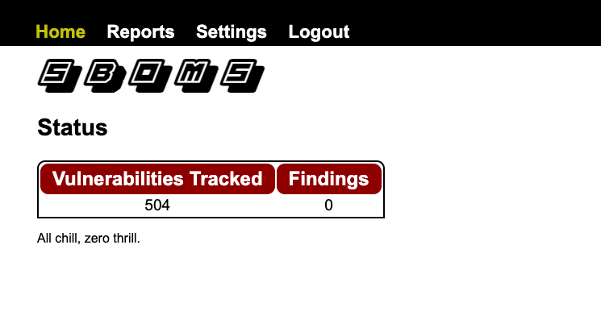
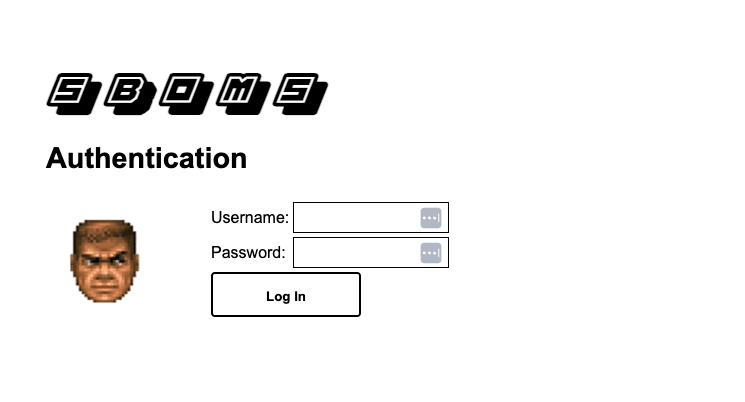
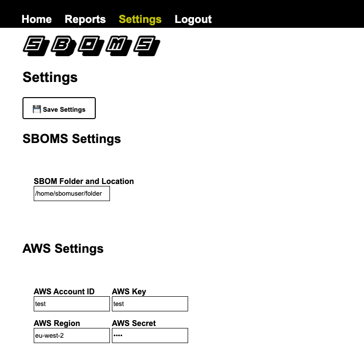
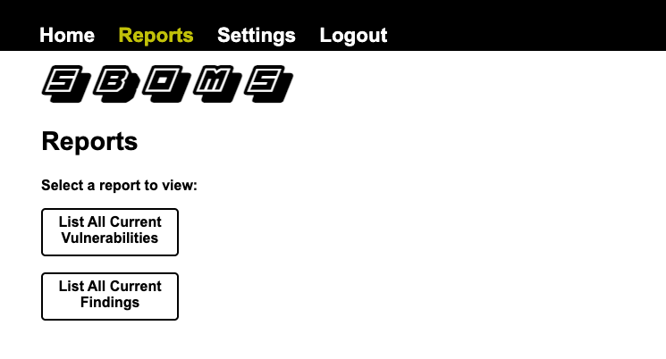
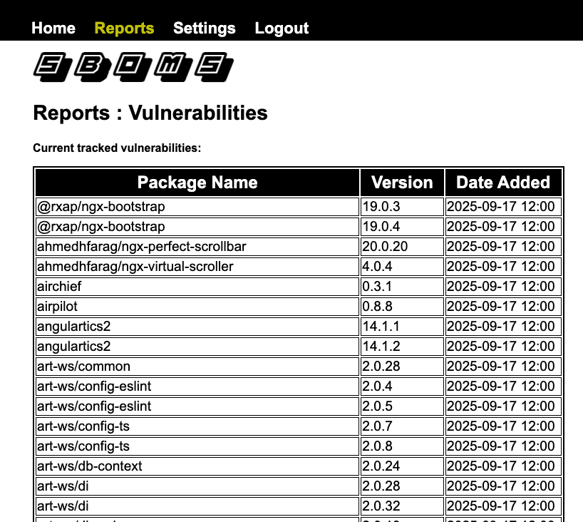

# SBOMS

Software Bill of Materials Searcher
A *very* dirty scanner for your SBOM directory. Scan for the latest NPM malware pacakges and get an indication of issues in your software chain.




# Running

## Ingestion of new items:

**/clu/ingest_csv.py**

Method: 

Write your CSV entries into a file named vulnlist.csv in the /sboms folder - this should be in the format:

```packagename,version```

e.g.

```rxnt-authentication,0.0.3```

Then run the function:

```python3 ingest_csv.py```

This will take all the items in the file and push them into the database with a date/time stamp.

## Run verification of SBOM

The search function runs through all the vulnerabilities logged in the database and scans a downloaded SBoM directory. Specify the directory in the /sboms/search.py code then run:

```python3 search.py```

This will run the SBOM check - you should launch this from your CRON job every 6 hours. The function needs updating to multi-threading once my brain hurts less.


# Web Interface
The primary web interface when running is available on port 8080:

http://localhost:8080

## Auth:

root , haxxor



## Settings:

Set your SBOM folder location in here that will be used for scanning. (AWS Settings are for planned expansion for grabbing data / pushing alerts and unused at present)



## Reports

View all vulnerabilities or findings in the reports section.





